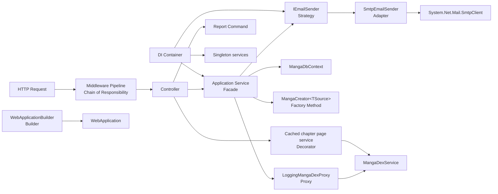
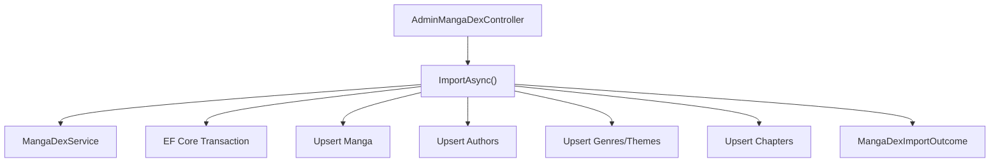
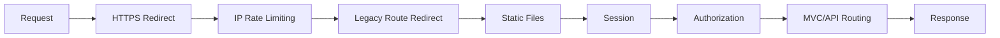
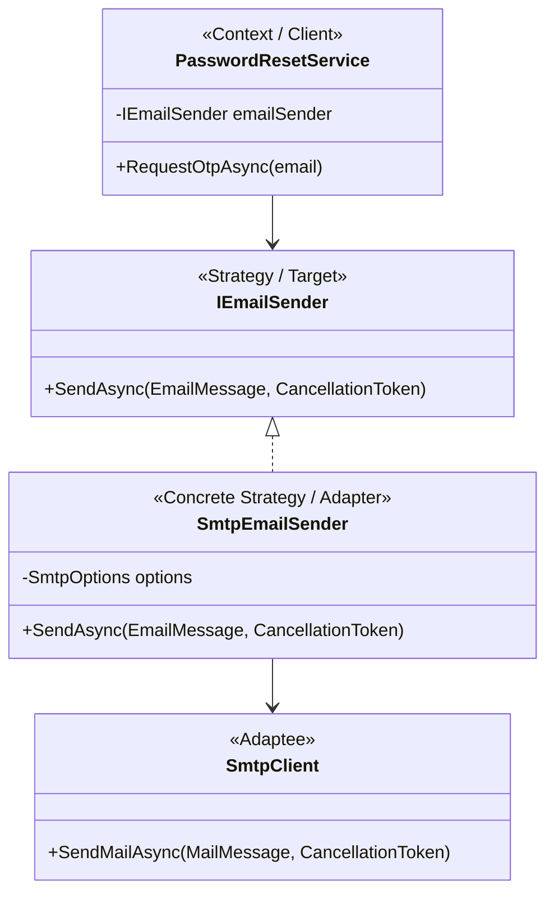

# PHÂN TÍCH MẪU THIẾT KẾ TRONG DỰ ÁN WEBDOCTRUYEN

## 1. Tổng quan

WebDocTruyen (MangaNPK) là ứng dụng đọc truyện được xây dựng bằng ASP.NET Core MVC, Web API, Entity Framework Core và SQL Server. Trong phạm vi 20 mẫu thiết kế được khảo sát, codebase hiện sử dụng mười mẫu có đủ bằng chứng kỹ thuật:

| Nhóm | Mẫu thiết kế | Mức độ áp dụng |
|---|---|---|
| Creational | Singleton | Sử dụng qua ASP.NET Core Dependency Injection |
| Creational | Builder | Sử dụng qua ASP.NET Core |
| Creational | Factory Method | Thể hiện rõ qua hệ thống `MangaCreator<TSource>` |
| Structural | Adapter | Thể hiện rõ trong code dự án |
| Structural | Decorator | Thể hiện rõ qua cache trang chương MangaDex |
| Structural | Facade | Thể hiện dưới dạng Application Facade |
| Structural | Proxy | Thể hiện rõ qua proxy ghi log MangaDex |
| Behavioral | Strategy | Thể hiện rõ trong code dự án |
| Behavioral | Chain of Responsibility | Sử dụng qua ASP.NET Core middleware pipeline |
| Behavioral | Command | Thể hiện rõ trong xử lý trạng thái báo cáo |

Tổng cộng: **10/20 mẫu**.

Trong đó:

- **Bảy mẫu thể hiện rõ trong code dự án:** Factory Method, Adapter, Decorator, Facade, Proxy, Strategy và Command.
- **Ba mẫu chủ yếu được framework cung cấp:** Singleton, Builder và Chain of Responsibility.

Tài liệu này sử dụng định nghĩa GoF tương đối chặt chẽ. Một đoạn code chỉ được tính là design pattern khi cấu trúc và mục đích của nó phù hợp với mẫu, không chỉ vì tên hàm hoặc cách triển khai có vẻ tương tự.

## 2. Sơ đồ tổng quát



---

## 3. Creational Patterns

### 3.1. Singleton Pattern

#### 3.1.1. Mục đích

Singleton bảo đảm một kiểu đối tượng chỉ có một instance dùng chung trong phạm vi vòng đời của ứng dụng và cung cấp điểm truy cập thống nhất đến instance đó.

Trong WebDocTruyen, Singleton không được cài đặt thủ công bằng biến `static Instance`. Vòng đời Singleton được quản lý bởi ASP.NET Core Dependency Injection container.

#### 3.1.2. Vị trí

- `backend/Program.cs`
- Dòng liên quan: 62 và 81–84.

#### 3.1.3. Code liên quan

```csharp
builder.Services.AddSingleton(TimeProvider.System);

builder.Services.AddSingleton<IIpPolicyStore, MemoryCacheIpPolicyStore>();
builder.Services.AddSingleton<IRateLimitCounterStore, MemoryCacheRateLimitCounterStore>();
builder.Services.AddSingleton<IRateLimitConfiguration, RateLimitConfiguration>();
builder.Services.AddSingleton<IProcessingStrategy, AsyncKeyLockProcessingStrategy>();
```

#### 3.1.4. Thành phần tham gia

| Thành phần | Vai trò |
|---|---|
| `IServiceCollection` | Nơi đăng ký dependency và vòng đời |
| `AddSingleton(...)` | Khai báo một instance dùng chung toàn ứng dụng |
| `TimeProvider.System` | Instance thời gian hệ thống dùng chung |
| Rate-limit stores/configuration | Trạng thái và cấu hình giới hạn request dùng chung |
| DI container | Tạo, lưu giữ và cấp phát singleton |

#### 3.1.5. Luồng hoạt động

1. Ứng dụng đăng ký service bằng `AddSingleton`.
2. DI container tạo instance ở lần đầu được yêu cầu hoặc sử dụng instance đã cung cấp.
3. Những component phụ thuộc service nhận cùng instance trong suốt vòng đời ứng dụng.
4. Container giải phóng instance khi ứng dụng dừng.

#### 3.1.6. Lợi ích

- Tránh tạo lặp lại các object lưu cấu hình hoặc trạng thái dùng chung.
- Quản lý vòng đời tập trung thông qua DI.
- Dễ thay implementation thông qua interface.
- Tránh phải tự viết khóa đồng bộ để khởi tạo singleton.

#### 3.1.7. Lưu ý

`MangaDbContext` được đăng ký bằng `AddDbContext`, mặc định có vòng đời **Scoped**, tức mỗi request có một instance riêng. Nó không phải Singleton và không nên gọi là “singleton-per-scope”.

Mức độ áp dụng: **dùng qua framework**.

---

### 3.2. Builder Pattern

#### 3.2.1. Mục đích

Builder tách quá trình cấu hình và xây dựng một đối tượng phức tạp khỏi đối tượng kết quả. Đối tượng được cấu hình qua nhiều bước, sau đó được tạo hoàn chỉnh bằng thao tác `Build()`.

#### 3.2.2. Vị trí

- `backend/Program.cs`
- Dòng liên quan: 10–90.

#### 3.2.3. Code liên quan

```csharp
var builder = WebApplication.CreateBuilder(args);

builder.Logging.ClearProviders();
builder.Logging.AddConsole();

builder.Services.AddDbContext<MangaDbContext>(options =>
    options.UseSqlServer(
        builder.Configuration.GetConnectionString("DefaultConnection")));

builder.Services.AddControllersWithViews(options =>
{
    options.Filters.Add(new AutoValidateAntiforgeryTokenAttribute());
});

builder.Services.AddSession(options =>
{
    options.IdleTimeout = TimeSpan.FromHours(8);
    options.Cookie.HttpOnly = true;
    options.Cookie.IsEssential = true;
    options.Cookie.SameSite = SameSiteMode.Lax;
});

builder.Services.AddScoped<IEmailSender, SmtpEmailSender>();
builder.Services.AddSingleton(TimeProvider.System);
builder.Services.AddScoped<PasswordResetService>();

var app = builder.Build();
```

Một chuỗi cấu hình fluent khác:

```csharp
builder.Services.AddDataProtection()
    .PersistKeysToFileSystem(new DirectoryInfo(dataProtectionKeysPath));
```

#### 3.2.4. Thành phần tham gia

| Thành phần | Vai trò |
|---|---|
| `WebApplicationBuilder` | Builder |
| Các lời gọi `builder.Services...` | Các bước cấu hình |
| `builder.Configuration` | Nguồn cấu hình đầu vào |
| `builder.Build()` | Thao tác tạo sản phẩm |
| `WebApplication` | Sản phẩm hoàn chỉnh |

#### 3.2.5. Luồng hoạt động

1. `CreateBuilder(args)` tạo builder ban đầu.
2. Ứng dụng lần lượt cấu hình logging, database, MVC, session, security và services.
3. Mỗi bước cập nhật trạng thái cấu hình bên trong builder.
4. `builder.Build()` tạo `WebApplication` hoàn chỉnh.
5. Ứng dụng tiếp tục cấu hình middleware trên sản phẩm đã được tạo.

#### 3.2.6. Lợi ích

- Tách cấu hình khởi động khỏi đối tượng ứng dụng hoàn chỉnh.
- Cho phép bổ sung hoặc bỏ từng thành phần theo môi trường.
- Cấu hình dễ đọc theo từng nhóm chức năng.
- Không cần constructor rất dài chứa toàn bộ tham số của ứng dụng.

#### 3.2.7. Lưu ý

Việc nối nhiều điều kiện vào một biến `IQueryable` chỉ là xây dựng truy vấn theo từng bước. Codebase không định nghĩa một lớp Query Builder có director, builder interface hoặc sản phẩm riêng, vì vậy không tính các truy vấn LINQ là Builder Pattern GoF.

Mức độ áp dụng: **dùng qua framework**.

---

### 3.3. Factory Method Pattern

#### 3.3.1. Mục đích

Factory Method định nghĩa một thao tác tạo sản phẩm ở lớp cơ sở nhưng để lớp con quyết định cách khởi tạo sản phẩm cụ thể. Dự án dùng mẫu này để chuẩn hóa việc tạo `Manga` từ bốn nguồn đầu vào khác nhau mà không thay đổi validation, transaction, quan hệ dữ liệu hoặc response của các luồng hiện có.

#### 3.3.2. Vị trí

- `backend/Services/MangaCreation/MangaCreator.cs`
- `backend/Services/MangaCreation/CatalogMangaCreator.cs`
- `backend/Services/MangaCreation/TitleDraftMangaCreator.cs`
- `backend/Services/MangaCreation/TitleSubmissionMangaCreator.cs`
- `backend/Services/MangaCreation/MangaDexMangaCreator.cs`
- `backend/Services/CatalogAdminService.cs`
- `backend/Services/TitleDraftAdminService.cs`
- `backend/Services/TitleSubmissionService.cs`
- `backend/Services/MangaDexImportService.cs`

#### 3.3.3. Creator và factory method

```csharp
public abstract class MangaCreator<TSource>
{
    public Manga Create(TSource source, DateTime now)
    {
        ArgumentNullException.ThrowIfNull(source);
        return CreateManga(source, now);
    }

    protected abstract Manga CreateManga(TSource source, DateTime now);
}
```

`Create()` là thao tác tạo công khai và `CreateManga()` là factory method được từng concrete creator override.

#### 3.3.4. Concrete creators

```csharp
public sealed class CatalogMangaCreator
    : MangaCreator<CreateMangaDto>
{
    protected override Manga CreateManga(
        CreateMangaDto dto,
        DateTime now) => new()
    {
        Title = dto.Title.Trim(),
        AlternativeTitle = dto.AlternativeTitle?.Trim() ?? string.Empty,
        Description = dto.Description?.Trim() ?? string.Empty,
        CoverUrl = dto.CoverUrl?.Trim() ?? string.Empty,
        Type = dto.Type,
        Status = dto.Status,
        Demographic = dto.Demographic,
        Format = dto.Format,
        ContentWarnings = string.Join(
            ',',
            MangaContentWarning.Normalize(dto.ContentWarnings)),
        ReleaseYear = dto.ReleaseYear,
        CreatedAt = now
    };
}
```

Ba creator còn lại giữ đúng quy tắc riêng của từng nguồn:

| Concrete creator | Nguồn dữ liệu | Quy tắc chính |
|---|---|---|
| `TitleDraftMangaCreator` | `TitleDraft` | Ghép tựa thay thế, fallback Webtoon sang Web Comic, giữ nguồn bản nháp |
| `TitleSubmissionMangaCreator` | `TitleSubmissionPayload` | Chuẩn hóa tựa, cảnh báo nội dung và nguồn Local/MangaDex |
| `MangaDexMangaCreator` | `MangaDexPreviewDto` | Gán nguồn, external id, thời điểm đồng bộ và content tag |

Ví dụ factory method của nguồn MangaDex:

```csharp
public sealed class MangaDexMangaCreator
    : MangaCreator<MangaDexPreviewDto>
{
    protected override Manga CreateManga(
        MangaDexPreviewDto preview,
        DateTime now) => new()
    {
        Title = preview.Title,
        AlternativeTitle = preview.AlternativeTitle,
        Description = preview.Description,
        CoverUrl = preview.CoverUrl,
        Type = preview.Type,
        Status = preview.Status,
        Demographic = preview.Demographic,
        Format = preview.Format,
        ReleaseYear = preview.ReleaseYear,
        Source = "MangaDex",
        ExternalId = preview.Id,
        CreatedAt = now,
        SyncedAt = now
    };
}
```

#### 3.3.5. Phía sử dụng

Các application service nhận creator tương ứng qua constructor và gọi `Create(...)` đúng tại nhánh cần tạo mới:

```csharp
var manga = _mangaCreator.Create(dto, _timeProvider.GetUtcNow().UtcDateTime);
```

Riêng `MangaDexImportService` chỉ gọi creator khi truyện chưa tồn tại; nhánh cập nhật truyện cũ vẫn giữ nguyên. Vì vậy refactor không thay đổi hành vi import.

#### 3.3.6. Ánh xạ vai trò

| Vai trò GoF | Thành phần trong dự án |
|---|---|
| Product | `Manga` |
| Creator | `MangaCreator<TSource>` |
| Factory method | `CreateManga(TSource, DateTime)` |
| Concrete creators | Bốn lớp creator theo từng nguồn |
| Clients | Bốn application service tạo/import truyện |

#### 3.3.7. Lợi ích

- Gom quy tắc khởi tạo `Manga` theo từng nguồn vào lớp có trách nhiệm rõ ràng.
- Tránh lặp lại các object initializer lớn trong service.
- Có thể kiểm thử riêng từng quy tắc tạo mà không cần database.
- Không thay đổi contract API, DTO hay schema cơ sở dữ liệu.

Mức độ áp dụng: **thể hiện rõ trong code dự án**.

---

## 4. Structural Patterns

### 4.1. Adapter Pattern

#### 4.1.1. Mục đích

Adapter chuyển giao diện của một lớp có sẵn thành giao diện mà phía sử dụng mong muốn. Nhờ đó, hai thành phần có giao diện không tương thích có thể làm việc cùng nhau.

Ví dụ rõ nhất trong dự án là `SmtpEmailSender`: lớp này chuyển API của `System.Net.Mail.SmtpClient` thành contract nội bộ `IEmailSender`.

#### 4.1.2. Vị trí

- `backend/Services/Email/IEmailSender.cs`
- `backend/Services/Email/SmtpEmailSender.cs`
- `backend/Services/PasswordResetService.cs`
- `backend/Program.cs`

#### 4.1.3. Target interface

```csharp
namespace MangaNPK.Services.Email;

public interface IEmailSender
{
    Task SendAsync(
        EmailMessage message,
        CancellationToken cancellationToken = default);
}
```

#### 4.1.4. Adapter implementation

```csharp
using System.Net;
using System.Net.Mail;
using Microsoft.Extensions.Options;

namespace MangaNPK.Services.Email;

public sealed class SmtpEmailSender(IOptions<SmtpOptions> options)
    : IEmailSender
{
    private readonly SmtpOptions _options = options.Value;

    public async Task SendAsync(
        EmailMessage message,
        CancellationToken cancellationToken = default)
    {
        EnsureConfigured();

        using var mail = new MailMessage
        {
            From = new MailAddress(
                _options.FromAddress,
                _options.FromName),
            Subject = message.Subject,
            Body = message.HtmlBody,
            IsBodyHtml = true
        };
        mail.To.Add(new MailAddress(message.To));

        using var client = new SmtpClient(
            _options.Host,
            _options.Port)
        {
            EnableSsl = _options.EnableSsl,
            UseDefaultCredentials = false,
            Credentials = new NetworkCredential(
                _options.Username,
                _options.Password)
        };

        await client.SendMailAsync(mail, cancellationToken);
    }

    private void EnsureConfigured()
    {
        if (string.IsNullOrWhiteSpace(_options.Host)
            || string.IsNullOrWhiteSpace(_options.FromAddress)
            || string.IsNullOrWhiteSpace(_options.Username)
            || string.IsNullOrWhiteSpace(_options.Password))
        {
            throw new InvalidOperationException(
                "SMTP email delivery is not configured.");
        }
    }
}
```

#### 4.1.5. Đăng ký adapter

```csharp
builder.Services.AddOptions<SmtpOptions>()
    .BindConfiguration(SmtpOptions.SectionName);

builder.Services.AddScoped<IEmailSender, SmtpEmailSender>();
```

#### 4.1.6. Phía sử dụng

```csharp
public sealed class PasswordResetService(
    MangaDbContext context,
    IEmailSender emailSender,
    TimeProvider timeProvider)
{
    // ...

    public async Task<PasswordResetResult> RequestOtpAsync(
        string email,
        CancellationToken cancellationToken = default)
    {
        // Tạo và lưu OTP...

        await emailSender.SendAsync(
            new EmailMessage(
                user.Email,
                "Mã OTP đặt lại mật khẩu MangaNPK",
                BuildOtpEmail(otp)),
            cancellationToken);

        // ...
    }
}
```

#### 4.1.7. Ánh xạ vai trò

| Vai trò GoF | Thành phần dự án |
|---|---|
| Client | `PasswordResetService` |
| Target | `IEmailSender` |
| Adapter | `SmtpEmailSender` |
| Adaptee | `System.Net.Mail.SmtpClient` |
| Dữ liệu trung gian | `EmailMessage`, `SmtpOptions` |

#### 4.1.8. Luồng hoạt động

1. `PasswordResetService` tạo `EmailMessage`.
2. Service gọi contract `IEmailSender.SendAsync()`.
3. DI cung cấp `SmtpEmailSender`.
4. Adapter chuyển `EmailMessage` thành `MailMessage`.
5. Adapter cấu hình `SmtpClient` và gửi email.

#### 4.1.9. Lợi ích

- Nghiệp vụ reset mật khẩu không phụ thuộc trực tiếp `SmtpClient`.
- Che giấu chi tiết cấu hình SMTP.
- Dễ thay nhà cung cấp email.
- Dễ kiểm thử bằng fake implementation của `IEmailSender`.

#### 4.1.10. Những lớp không nên gọi là Adapter

- `MangaDexMetadataMapper` là Mapper.
- `ContributorRoleClassifier` là bộ phân loại/chuẩn hóa.
- `LegacyRouteRedirect` là bộ phân giải URL cũ.
- `MangaDexService` là API Client/Gateway và đồng thời là real subject/concrete component của Proxy và Decorator; nó không phải Adapter vì không chuyển một adaptee có interface không tương thích sang contract nội bộ.

Mức độ áp dụng: **thể hiện rõ trong code dự án**.

---

### 4.2. Facade Pattern

#### 4.2.1. Mục đích

Facade cung cấp một giao diện cấp cao, đơn giản cho một hệ thống con gồm nhiều thao tác phức tạp. Client chỉ cần gọi một số phương thức chính thay vì tự điều phối database, external API, transaction, validation và mapping.

Trong dự án, Facade được áp dụng theo dạng **Application Facade**, thể hiện qua các service nghiệp vụ.

#### 4.2.2. Ví dụ chính: `MangaDexImportService`

Vị trí:

- `backend/Services/MangaDexImportService.cs`
- `backend/Services/MangaDexService.cs`
- `backend/Controllers/AdminMangaDexController.cs`

Controller chỉ gọi một phương thức cấp cao:

```csharp
[ApiController]
[Route("api/admin")]
[RequireAdmin]
public class AdminMangaDexController(
    MangaDexImportService importService) : ControllerBase
{
    private readonly MangaDexImportService _importService = importService;

    [HttpPost("mangadex/import")]
    public async Task<IActionResult> ImportMangaDex(
        [FromBody] MangaDexImportRequest dto)
    {
        var result = await _importService.ImportAsync(
            dto.Input,
            HttpContext.RequestAborted);

        return result.Status == MangaDexImportStatus.Success
            ? Ok(new
            {
                message = result.Message,
                mangaId = result.MangaId,
                chapterCount = result.ChapterCount
            })
            : ToError(
                result.Status,
                result.Message,
                result.Error);
    }
}
```

Facade điều phối toàn bộ quá trình import:

```csharp
public sealed class MangaDexImportService(
    MangaDbContext context,
    IMangaDexService mangaDexService,
    MangaDexMangaCreator mangaCreator)
{
    private readonly MangaDbContext _context = context;
    private readonly IMangaDexService _mangaDexService = mangaDexService;
    private readonly MangaDexMangaCreator _mangaCreator = mangaCreator;

    public async Task<MangaDexImportOutcome> ImportAsync(
        string input,
        CancellationToken cancellationToken = default)
    {
        if (string.IsNullOrWhiteSpace(input))
            return new(
                MangaDexImportStatus.BadRequest,
                "Vui lòng nhập URL hoặc UUID MangaDex.");

        await using var transaction =
            await _context.Database.BeginTransactionAsync(cancellationToken);

        try
        {
            var preview =
                await _mangaDexService.GetMangaPreviewAsync(
                    input,
                    cancellationToken);

            var chapters =
                await _mangaDexService.GetVietnameseChaptersAsync(
                    preview.Id,
                    cancellationToken);

            var manga = await _context.Mangas
                .Include(item => item.MangaAuthors)
                .Include(item => item.MangaGenres)
                .Include(item => item.MangaThemes)
                .FirstOrDefaultAsync(
                    item => item.Source == "MangaDex"
                        && item.ExternalId == preview.Id,
                    cancellationToken);

            // Tạo mới hoặc cập nhật manga...
            await _context.SaveChangesAsync(cancellationToken);

            await UpsertAuthorsAsync(
                manga,
                preview.Authors,
                cancellationToken);

            await UpsertTagsAsync(
                manga,
                preview.Tags,
                cancellationToken);

            // Tạo hoặc cập nhật các chapter...
            await _context.SaveChangesAsync(cancellationToken);
            await transaction.CommitAsync(cancellationToken);

            return new(
                MangaDexImportStatus.Success,
                "Đồng bộ MangaDex thành công.",
                manga.Id,
                chapters.Count);
        }
        catch (ArgumentException ex)
        {
            await transaction.RollbackAsync(cancellationToken);
            return new(
                MangaDexImportStatus.BadRequest,
                ex.Message);
        }
        catch (HttpRequestException ex)
        {
            await transaction.RollbackAsync(cancellationToken);
            return new(
                MangaDexImportStatus.BadGateway,
                "Không thể gọi MangaDex API.",
                Error: ex.Message);
        }
    }
}
```

#### 4.2.3. Các subsystem được che giấu



Controller không cần biết:

- Cách phân tích URL hoặc UUID MangaDex.
- Cách gọi nhiều endpoint MangaDex.
- Cách tạo hoặc cập nhật manga.
- Cách đồng bộ tác giả, thể loại, chủ đề và chapter.
- Cách quản lý transaction và rollback.
- Cách chuyển exception thành kết quả nghiệp vụ.

#### 4.2.4. Các Facade khác

`TitleSubmissionService` che giấu:

```csharp
public async Task<TitleSubmissionResult> SubmitAsync(
    TitleSubmissionPayload payload,
    int userId,
    bool isAdmin,
    CancellationToken cancellationToken = default)
{
    var error = TitleSubmissionValidation.Validate(
        payload,
        requireCover: true);

    if (error != null)
        throw new ArgumentException(error);

    return isAdmin
        ? new TitleSubmissionResult(
            "Manga",
            MangaId: await CreateMangaAsync(
                payload,
                cancellationToken))
        : new TitleSubmissionResult(
            "Draft",
            DraftId: await CreateDraftAsync(
                payload,
                userId,
                cancellationToken));
}
```

`PasswordResetService` che giấu:

- Chuẩn hóa và tìm người dùng.
- Tạo OTP an toàn.
- Hash OTP.
- Giới hạn gửi lại.
- Lưu yêu cầu reset.
- Gửi email.
- Xác minh OTP.
- Tạo reset token.
- Đổi mật khẩu và vô hiệu hóa request.

#### 4.2.5. Lợi ích

- Controller nhỏ hơn và ít phụ thuộc.
- Quy trình nghiệp vụ nằm trong một service thống nhất.
- Transaction và error handling được quản lý tập trung.
- Có thể tái sử dụng cùng nghiệp vụ từ controller khác.
- Dễ kiểm thử theo từng use case.

#### 4.2.6. Lưu ý

Không nên gọi mọi controller là Facade. Controller chủ yếu là lớp tiếp nhận HTTP và chuyển đổi request/response. Chỉ các service thực sự che giấu một subsystem hoặc một chuỗi nghiệp vụ phức tạp mới được xem là Application Facade.

Mức độ áp dụng: **thể hiện rõ trong code dự án**.

---

### 4.3. Decorator Pattern

#### 4.3.1. Mục đích

Decorator bọc một component qua chính contract của component đó để bổ sung hành vi mà không sửa real component. Dự án dùng Decorator để thêm cache năm phút cho danh sách URL ảnh của một chương MangaDex.

#### 4.3.2. Vị trí

- `backend/Services/MangaDex/IMangaDexChapterPageService.cs`
- `backend/Services/MangaDex/CachedMangaDexChapterPageService.cs`
- `backend/Services/MangaDexService.cs`
- `backend/Controllers/ChapterController.cs`
- `backend/Controllers/ChapterViewController.cs`
- `backend/Program.cs`

#### 4.3.3. Component interface

```csharp
public interface IMangaDexChapterPageService
{
    Task<List<string>> GetChapterPageUrlsAsync(
        string chapterExternalId,
        bool dataSaver = false,
        CancellationToken cancellationToken = default);
}
```

`MangaDexService` là concrete component thực hiện request thật đến MangaDex At-Home API. Decorator triển khai cùng interface và giữ một component bên trong:

```csharp
public sealed class CachedMangaDexChapterPageService(
    IMangaDexChapterPageService inner,
    IMemoryCache cache) : IMangaDexChapterPageService
{
    private static readonly TimeSpan CacheDuration = TimeSpan.FromMinutes(5);
    private readonly IMangaDexChapterPageService _inner = inner;
    private readonly IMemoryCache _cache = cache;

    public async Task<List<string>> GetChapterPageUrlsAsync(
        string chapterExternalId,
        bool dataSaver = false,
        CancellationToken cancellationToken = default)
    {
        var cacheKey =
            $"mangadex-at-home:{chapterExternalId}:{dataSaver}";

        if (_cache.TryGetValue(cacheKey, out List<string>? cached)
            && cached is not null)
        {
            return cached;
        }

        var urls = await _inner.GetChapterPageUrlsAsync(
            chapterExternalId,
            dataSaver,
            cancellationToken);

        _cache.Set(cacheKey, urls, CacheDuration);
        return urls;
    }
}
```

#### 4.3.4. Lắp ghép bằng DI

```csharp
builder.Services.AddScoped<MangaDexService>();
builder.Services.AddScoped<IMangaDexChapterPageService>(provider =>
    new CachedMangaDexChapterPageService(
        provider.GetRequiredService<MangaDexService>(),
        provider.GetRequiredService<IMemoryCache>()));
```

Controller chỉ phụ thuộc `IMangaDexChapterPageService`, nên không biết nó đang gọi decorator hay real component.

#### 4.3.5. Ánh xạ vai trò

| Vai trò GoF | Thành phần trong dự án |
|---|---|
| Component | `IMangaDexChapterPageService` |
| Concrete component | `MangaDexService` |
| Decorator | `CachedMangaDexChapterPageService` |
| Trạng thái bổ sung | `IMemoryCache` |
| Clients | `ChapterController`, `ChapterViewController` |

#### 4.3.6. Bảo toàn hành vi

- Cache key phân biệt cả chapter id và `dataSaver`.
- Cache hit trả đúng danh sách đã lưu.
- Cache miss chuyển tiếp đầy đủ cancellation token.
- Exception từ dịch vụ thật không bị đổi kiểu hoặc nuốt.
- Thời gian cache vẫn là năm phút như hành vi trước refactor.

Mức độ áp dụng: **thể hiện rõ trong code dự án**.

---

### 4.4. Proxy Pattern

#### 4.4.1. Mục đích

Proxy cung cấp đối tượng đại diện có cùng contract với real subject và kiểm soát việc truy cập đến real subject. Dự án dùng protection/observability proxy theo nghĩa kiểm soát lời gọi để ghi log thành công, thất bại và số chương trả về từ MangaDex mà không làm `MangaDexImportService` phụ thuộc chi tiết này.

#### 4.4.2. Vị trí

- `backend/Services/MangaDex/IMangaDexService.cs`
- `backend/Services/MangaDex/LoggingMangaDexProxy.cs`
- `backend/Services/MangaDexService.cs`
- `backend/Services/MangaDexImportService.cs`
- `backend/Program.cs`

#### 4.4.3. Subject interface

```csharp
public interface IMangaDexService
{
    Task<MangaDexPreviewDto> GetMangaPreviewAsync(
        string input,
        CancellationToken cancellationToken = default);

    Task<List<MangaDexChapterDto>> GetVietnameseChaptersAsync(
        string mangaId,
        CancellationToken cancellationToken = default);
}
```

`MangaDexService` và `LoggingMangaDexProxy` đều triển khai `IMangaDexService`. Proxy giữ real subject và chuyển tiếp lời gọi:

```csharp
public sealed class LoggingMangaDexProxy(
    IMangaDexService inner,
    ILogger<LoggingMangaDexProxy> logger) : IMangaDexService
{
    public async Task<MangaDexPreviewDto> GetMangaPreviewAsync(
        string input,
        CancellationToken cancellationToken = default)
    {
        logger.LogInformation("Calling MangaDex preview API.");
        try
        {
            var result = await inner.GetMangaPreviewAsync(
                input,
                cancellationToken);
            logger.LogInformation("MangaDex preview API succeeded.");
            return result;
        }
        catch (Exception exception)
            when (exception is not OperationCanceledException)
        {
            logger.LogError(exception, "MangaDex preview API failed.");
            throw;
        }
    }
}
```

Phương thức chapter feed áp dụng cùng cấu trúc và chỉ ghi thêm số chương. Proxy không ghi raw input hoặc manga id để tránh đưa dữ liệu đầu vào không cần thiết vào log.

#### 4.4.4. Lắp ghép bằng DI

```csharp
builder.Services.AddScoped<IMangaDexService>(provider =>
    new LoggingMangaDexProxy(
        provider.GetRequiredService<MangaDexService>(),
        provider.GetRequiredService<ILogger<LoggingMangaDexProxy>>()));
```

`MangaDexImportService` nhận `IMangaDexService`; vì vậy toàn bộ truy cập metadata đi qua proxy nhưng giá trị trả về, cancellation và exception vẫn được bảo toàn.

#### 4.4.5. Ánh xạ vai trò

| Vai trò GoF | Thành phần trong dự án |
|---|---|
| Subject | `IMangaDexService` |
| Real subject | `MangaDexService` |
| Proxy | `LoggingMangaDexProxy` |
| Client | `MangaDexImportService` |

#### 4.4.6. Phân biệt với Decorator

Cả hai đều bọc object qua interface chung, nhưng mục đích khác nhau:

- Decorator bổ sung cache như một trách nhiệm có thể xếp chồng cho thao tác lấy trang chương.
- Proxy đại diện và kiểm soát truy cập metadata MangaDex để tạo log quan sát.

Mức độ áp dụng: **thể hiện rõ trong code dự án**.

---

## 5. Behavioral Patterns

### 5.1. Strategy Pattern

#### 5.1.1. Mục đích

Strategy định nghĩa một nhóm thuật toán hoặc hành vi có thể thay thế cho nhau, đóng gói từng hành vi sau một contract chung và cho phép client sử dụng mà không phụ thuộc implementation cụ thể.

Trong dự án, chiến lược gửi email được trừu tượng hóa bằng `IEmailSender`.

#### 5.1.2. Vị trí

- `backend/Services/Email/IEmailSender.cs`
- `backend/Services/Email/SmtpEmailSender.cs`
- `backend/Services/PasswordResetService.cs`
- `backend/Program.cs`

#### 5.1.3. Code liên quan

Strategy interface:

```csharp
public interface IEmailSender
{
    Task SendAsync(
        EmailMessage message,
        CancellationToken cancellationToken = default);
}
```

Concrete strategy:

```csharp
public sealed class SmtpEmailSender : IEmailSender
{
    public async Task SendAsync(
        EmailMessage message,
        CancellationToken cancellationToken = default)
    {
        // Chuyển EmailMessage thành MailMessage
        // và gửi bằng SmtpClient.
    }
}
```

Context:

```csharp
public sealed class PasswordResetService(
    MangaDbContext context,
    IEmailSender emailSender,
    TimeProvider timeProvider)
{
    public async Task<PasswordResetResult> RequestOtpAsync(
        string email,
        CancellationToken cancellationToken = default)
    {
        // Tạo OTP và lưu request...

        await emailSender.SendAsync(
            new EmailMessage(
                user.Email,
                "Mã OTP đặt lại mật khẩu MangaNPK",
                BuildOtpEmail(otp)),
            cancellationToken);

        // ...
    }
}
```

Chọn strategy bằng DI:

```csharp
builder.Services.AddScoped<IEmailSender, SmtpEmailSender>();
```

#### 5.1.4. Ánh xạ vai trò

| Vai trò GoF | Thành phần dự án |
|---|---|
| Strategy | `IEmailSender` |
| Concrete Strategy | `SmtpEmailSender` |
| Context | `PasswordResetService` |
| Cơ chế lựa chọn | ASP.NET Core Dependency Injection |

#### 5.1.5. Khả năng mở rộng

Không cần sửa `PasswordResetService` nếu thêm strategy khác:

```csharp
public sealed class SendGridEmailSender : IEmailSender
{
    public Task SendAsync(
        EmailMessage message,
        CancellationToken cancellationToken = default)
    {
        // Gửi bằng SendGrid API.
        throw new NotImplementedException();
    }
}
```

Chỉ cần đổi đăng ký:

```csharp
builder.Services.AddScoped<IEmailSender, SendGridEmailSender>();
```

Đoạn `SendGridEmailSender` trên chỉ minh họa khả năng mở rộng của cấu trúc, không phải class đang tồn tại trong codebase.

#### 5.1.6. Lợi ích

- Tuân thủ Dependency Inversion Principle.
- Thay đổi nhà cung cấp email mà không sửa nghiệp vụ OTP.
- Dễ mock/fake khi kiểm thử.
- Giảm phụ thuộc trực tiếp vào thư viện SMTP.

#### 5.1.7. Lưu ý

- Hiện codebase chỉ có một concrete strategy gửi email là `SmtpEmailSender`.
- `IFollowedUpdatesService` tạo abstraction nhưng chưa có nhiều thuật toán thay thế; có thể mở rộng theo Strategy nhưng không phải ví dụ mạnh bằng email.
- `MangaSearchRanking.Score()` là một thuật toán chứa nhiều nhánh tính điểm. Các nhánh không được đóng gói thành những strategy object riêng, vì vậy không tính nó là Strategy Pattern.

Mức độ áp dụng: **thể hiện rõ trong code dự án**.

---

### 5.2. Chain of Responsibility Pattern

#### 5.2.1. Mục đích

Chain of Responsibility truyền một request qua chuỗi handler. Mỗi handler có thể:

- Xử lý request và kết thúc chuỗi.
- Bổ sung hành vi rồi chuyển request cho handler tiếp theo.
- Bỏ qua và chuyển tiếp request.

ASP.NET Core middleware pipeline là một implementation điển hình của mẫu này.

#### 5.2.2. Vị trí

- `backend/Program.cs`
- Dòng liên quan: 107–139.

#### 5.2.3. Code liên quan

```csharp
if (!app.Environment.IsDevelopment())
{
    app.UseHttpsRedirection();
}

app.UseIpRateLimiting();

app.Use(async (context, next) =>
{
    var destination = LegacyRouteRedirect.Resolve(
        context.Request.Path.Value,
        context.Request.Query["mangaId"].FirstOrDefault(),
        context.Request.Query["chapterId"].FirstOrDefault());

    if (destination is not null)
    {
        context.Response.Redirect(
            destination,
            permanent: false);
        return;
    }

    await next();
});

app.UseStaticFiles();
app.UseSession();
app.UseAuthorization();

app.MapControllerRoute(
    name: "default",
    pattern: "{controller=Home}/{action=Index}/{id?}");

app.MapControllers();
```

#### 5.2.4. Chuỗi handler



#### 5.2.5. Ví dụ chuyển tiếp hoặc kết thúc

```csharp
if (destination is not null)
{
    context.Response.Redirect(destination, permanent: false);
    return; // Kết thúc chuỗi.
}

await next(); // Chuyển cho handler tiếp theo.
```

Nếu tìm thấy route cũ, middleware trả redirect và không gọi `next()`. Nếu không tìm thấy, request tiếp tục đi qua phần còn lại của pipeline.

#### 5.2.6. Ánh xạ vai trò

| Vai trò GoF | Thành phần dự án |
|---|---|
| Request | `HttpContext` |
| Handler | Mỗi middleware |
| Successor | Delegate `next` |
| Concrete handlers | Rate limiting, redirect, static files, session, authorization |
| Client | ASP.NET Core host gửi request vào pipeline |

#### 5.2.7. Lợi ích

- Mỗi middleware có một trách nhiệm riêng.
- Dễ thêm, bỏ hoặc thay đổi thứ tự handler.
- Middleware không cần biết toàn bộ chuỗi phía sau.
- Một handler có thể kết thúc request sớm.
- Các concern dùng chung không bị lặp trong controller.

#### 5.2.8. Lưu ý

Chuỗi câu lệnh `if` trong `RequireAdminAttribute` hoặc `ChapterImageValidator` không tự động trở thành Chain of Responsibility. Những đoạn đó là kiểm tra tuần tự trong cùng một method, không phải các handler độc lập liên kết qua successor.

Mức độ áp dụng: **dùng qua framework và có middleware tùy chỉnh trong dự án**.

---

### 5.3. Command Pattern

#### 5.3.1. Mục đích

Command đóng gói một yêu cầu thành object độc lập, tách nơi phát yêu cầu khỏi nơi thực thi. Dự án áp dụng Command cho thao tác quản trị cập nhật trạng thái báo cáo; controller chỉ chuyển HTTP input thành command và ánh xạ kết quả trở lại HTTP response.

#### 5.3.2. Vị trí

- `backend/Services/Reports/UpdateReportStatusCommand.cs`
- `backend/Services/Reports/IReportCommandHandler.cs`
- `backend/Services/Reports/UpdateReportStatusCommandHandler.cs`
- `backend/Controllers/ReportsController.cs`
- `backend/Program.cs`

#### 5.3.3. Command và result

```csharp
public sealed record UpdateReportStatusCommand(
    int ReportId,
    string? Status,
    string? AdminNote,
    int? ResolvedByUserId);

public enum ReportCommandStatus
{
    Success,
    NotFound,
    BadRequest
}

public sealed record ReportCommandResult(
    ReportCommandStatus Status,
    string Message = "",
    int? ReportId = null,
    ReportStatus? ReportStatus = null);
```

Command chứa toàn bộ dữ liệu cần để thực hiện use case. Result không phụ thuộc MVC, nên handler vẫn là lớp nghiệp vụ có thể kiểm thử độc lập.

#### 5.3.4. Handler

```csharp
public interface IReportCommandHandler
{
    Task<ReportCommandResult> ExecuteAsync(
        UpdateReportStatusCommand command,
        CancellationToken cancellationToken = default);
}
```

```csharp
public sealed class UpdateReportStatusCommandHandler(
    MangaDbContext context,
    TimeProvider timeProvider) : IReportCommandHandler
{
    public async Task<ReportCommandResult> ExecuteAsync(
        UpdateReportStatusCommand command,
        CancellationToken cancellationToken = default)
    {
        if (!Enum.TryParse<ReportStatus>(
                command.Status,
                true,
                out var status)
            || status == ReportStatus.Pending)
        {
            return new(
                ReportCommandStatus.BadRequest,
                "Trạng thái xử lý không hợp lệ.");
        }

        var report = await context.Reports.FindAsync(
            [command.ReportId],
            cancellationToken);
        if (report is null)
        {
            return new(
                ReportCommandStatus.NotFound,
                "Không tìm thấy báo cáo.");
        }

        report.Status = status;
        report.ResolvedAt = timeProvider.GetUtcNow().UtcDateTime;
        report.ResolvedByUserId = command.ResolvedByUserId;
        report.AdminNote = string.IsNullOrWhiteSpace(command.AdminNote)
            ? null
            : command.AdminNote.Trim();

        await context.SaveChangesAsync(cancellationToken);
        return new(
            ReportCommandStatus.Success,
            ReportId: report.Id,
            ReportStatus: report.Status);
    }
}
```

#### 5.3.5. Invoker

`ReportsController.UpdateStatus` là invoker ở biên HTTP:

```csharp
var result = await _reportCommandHandler.ExecuteAsync(
    new UpdateReportStatusCommand(
        id,
        dto.Status,
        dto.AdminNote,
        GetCurrentUserId()),
    cancellationToken);
```

Controller giữ nguyên route `PATCH /api/reports/{id}`, quyền admin, DTO và cấu trúc JSON cũ. Chỉ logic thực thi được chuyển vào handler.

#### 5.3.6. Ánh xạ vai trò

| Vai trò GoF | Thành phần trong dự án |
|---|---|
| Command | `UpdateReportStatusCommand` |
| Handler/Receiver | `UpdateReportStatusCommandHandler` |
| Handler contract | `IReportCommandHandler` |
| Invoker | `ReportsController.UpdateStatus` |
| State receiver | `MangaDbContext` và entity `Report` |

#### 5.3.7. Lợi ích và phạm vi

- Tách HTTP concern khỏi validation và cập nhật trạng thái.
- Kiểm thử được mọi nhánh bằng handler thuần: sai trạng thái, không tìm thấy, resolved và dismissed.
- Dễ bổ sung logging, audit hoặc pipeline cho command sau này.
- Mẫu hiện không triển khai undo/queue; hai khả năng đó không phải điều kiện bắt buộc để một request object là Command.

Mức độ áp dụng: **thể hiện rõ trong code dự án**.

---

## 6. Quan hệ giữa Adapter và Strategy trong chức năng email

Một class có thể tham gia nhiều mẫu nếu được nhìn theo các mục đích khác nhau:



- Xét theo khả năng thay đổi cách gửi email, `IEmailSender` và `SmtpEmailSender` tạo thành **Strategy**.
- Xét theo việc chuyển API `SmtpClient` sang `IEmailSender`, `SmtpEmailSender` là **Adapter**.

Hai kết luận không mâu thuẫn vì chúng mô tả hai mục đích khác nhau của cùng cấu trúc.

---

## 7. Các mẫu chưa có trong dự án

| STT | Mẫu | Kết luận | Lý do |
|---:|---|---|---|
| 1 | Prototype | Chưa có | Không có `ICloneable`, `Clone()` hoặc cơ chế sao chép prototype |
| 2 | Abstract Factory | Chưa có | Không có factory tạo ra một họ các sản phẩm liên quan |
| 3 | Observer | Chưa có | Không có subject/observer, subscribe/unsubscribe hoặc event notification tương ứng |
| 4 | Bridge | Chưa có | Không có hai hierarchy abstraction và implementation phát triển độc lập |
| 5 | Composite | Chưa có | Không có component/leaf/composite xử lý cấu trúc cây đồng nhất |
| 6 | Flyweight | Chưa có | Cache không đồng nghĩa với chia sẻ intrinsic state giữa nhiều flyweight |
| 7 | Interpreter | Chưa có | Không có grammar, expression tree hoặc interpreter cho ngôn ngữ riêng |
| 8 | Mediator | Chưa có | Không có mediator điều phối giao tiếp giữa các colleague object |
| 9 | Memento | Chưa có | Không có snapshot để lưu và khôi phục trạng thái |
| 10 | Visitor | Chưa có | Không có visitor và `Accept()` để thêm operation lên object structure |

## 8. Các trường hợp dễ gán nhầm

### 8.1. `FindOrCreate...` không phải Factory Method

Các method như:

```csharp
FindOrCreateGenreAsync(...)
FindOrCreateThemeAsync(...)
ResolveAuthorAsync(...)
```

là helper CRUD tìm bản ghi hoặc tạo mới. Chúng không được subclass override để quyết định concrete product, nên không phải Factory Method theo GoF.

### 8.2. `SaveChangesAsync()` không phải Observer

```csharp
public override Task<int> SaveChangesAsync(
    bool acceptAllChangesOnSuccess,
    CancellationToken cancellationToken = default)
{
    NormalizeUserIdentities();
    return base.SaveChangesAsync(
        acceptAllChangesOnSuccess,
        cancellationToken);
}
```

Đây là method override/lifecycle hook. Code không có observer đăng ký nhận thông báo từ subject.

### 8.3. Cache Decorator không phải Proxy ghi log

Cache trang chương trước đây nằm nội bộ trong `MangaDexService`, nhưng hiện đã được tách thành `CachedMangaDexChapterPageService`. Nó là Decorator vì triển khai `IMangaDexChapterPageService`, giữ một component cùng interface và bổ sung cache.

`LoggingMangaDexProxy` là Proxy riêng cho metadata MangaDex. Nó và real subject cùng triển khai `IMangaDexService`, còn mục đích chính là kiểm soát lời gọi và ghi log. Không nên gộp hai kết luận chỉ vì cả hai cùng dùng kỹ thuật wrapping.

### 8.4. Authorization filter không phải Decorator GoF chuẩn

`RequireAdminAttribute` bổ sung kiểm tra trước action nhưng:

- Không triển khai cùng interface với controller/action.
- Không giữ một component được bọc.
- Không gọi operation tương ứng trên component thông qua interface chung.

Có thể mô tả nó là “decorator-like cross-cutting behavior” ở mức framework, nhưng không nên khẳng định dự án đã tự triển khai Decorator Pattern.

### 8.5. Mapping không phải Adapter trong mọi trường hợp

Một hàm đổi enum, chuẩn hóa chuỗi hoặc chuyển DTO không tự động là Adapter. Adapter cần một target interface mà client mong đợi và một adaptee có interface không tương thích. Trong dự án, `SmtpEmailSender` đáp ứng cấu trúc này rõ nhất.

---

## 9. Đánh giá tổng hợp

| Nhóm | Có | Chưa có/chưa xác nhận | Tổng |
|---|---:|---:|---:|
| Creational | 3 | 2 | 5 |
| Structural | 4 | 3 | 7 |
| Behavioral | 3 | 5 | 8 |
| **Tổng cộng** | **10** | **10** | **20** |

### Creational

- Có: Singleton, Builder, Factory Method.
- Chưa có: Prototype, Abstract Factory.

### Structural

- Có: Adapter, Decorator, Facade, Proxy.
- Chưa có: Bridge, Composite, Flyweight.

### Behavioral

- Có: Strategy, Chain of Responsibility, Command.
- Chưa có: Observer, Interpreter, Mediator, Memento, Visitor.

## 10. Kết luận

WebDocTruyen hiện sử dụng mười trong 20 mẫu thiết kế được khảo sát:

1. Singleton.
2. Builder.
3. Factory Method.
4. Adapter.
5. Decorator.
6. Facade.
7. Proxy.
8. Strategy.
9. Chain of Responsibility.
10. Command.

Factory Method, Adapter, Decorator, Facade, Proxy, Strategy và Command được thể hiện trực tiếp trong code dự án. Singleton, Builder và Chain of Responsibility chủ yếu được áp dụng thông qua cơ chế của ASP.NET Core, trong đó dự án có cấu hình vòng đời dependency và middleware tùy chỉnh.

Việc bổ sung bốn mẫu mới được thực hiện bằng refactor có kiểm thử, giữ nguyên route, DTO, JSON, giao diện và schema cơ sở dữ liệu. Báo cáo vì vậy phản ánh đúng code hiện tại và không tính nhầm những đoạn CRUD, mapping hoặc lifecycle hook thành các mẫu GoF không thực sự tồn tại.

## 11. Danh sách source tham chiếu

- `backend/Program.cs`
- `backend/Services/Email/IEmailSender.cs`
- `backend/Services/Email/SmtpEmailSender.cs`
- `backend/Services/Email/EmailMessage.cs`
- `backend/Services/Email/SmtpOptions.cs`
- `backend/Services/PasswordResetService.cs`
- `backend/Services/MangaDexImportService.cs`
- `backend/Services/MangaDexService.cs`
- `backend/Services/MangaDex/IMangaDexService.cs`
- `backend/Services/MangaDex/LoggingMangaDexProxy.cs`
- `backend/Services/MangaDex/IMangaDexChapterPageService.cs`
- `backend/Services/MangaDex/CachedMangaDexChapterPageService.cs`
- `backend/Services/MangaCreation/MangaCreator.cs`
- `backend/Services/MangaCreation/CatalogMangaCreator.cs`
- `backend/Services/MangaCreation/TitleDraftMangaCreator.cs`
- `backend/Services/MangaCreation/TitleSubmissionMangaCreator.cs`
- `backend/Services/MangaCreation/MangaDexMangaCreator.cs`
- `backend/Services/Reports/UpdateReportStatusCommand.cs`
- `backend/Services/Reports/IReportCommandHandler.cs`
- `backend/Services/Reports/UpdateReportStatusCommandHandler.cs`
- `backend/Services/TitleSubmissionService.cs`
- `backend/Services/TitleDraftAdminService.cs`
- `backend/Services/CatalogAdminService.cs`
- `backend/Controllers/AdminMangaDexController.cs`
- `backend/Controllers/ChapterController.cs`
- `backend/Controllers/ChapterViewController.cs`
- `backend/Controllers/ReportsController.cs`
- `backend/Filters/RequireAdminAttribute.cs`
- `backend/Filters/RequireAuthAttribute.cs`
- `backend/Data/MangaDbContext.cs`
