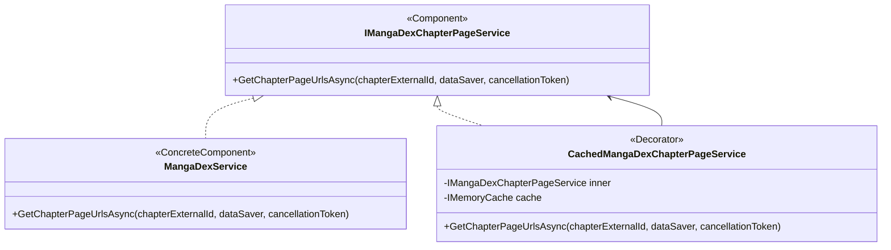
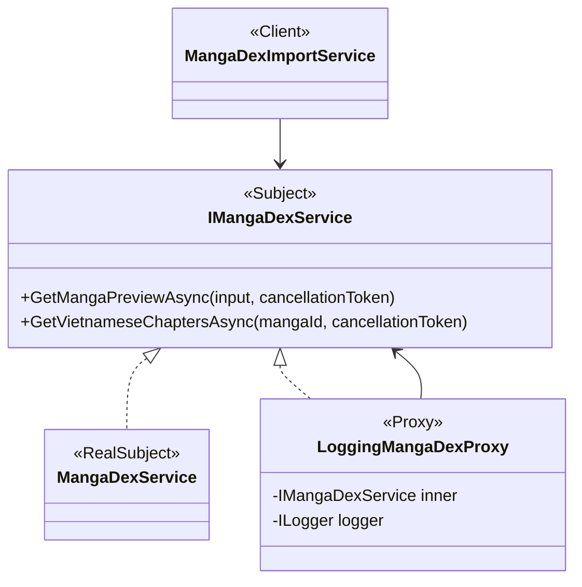
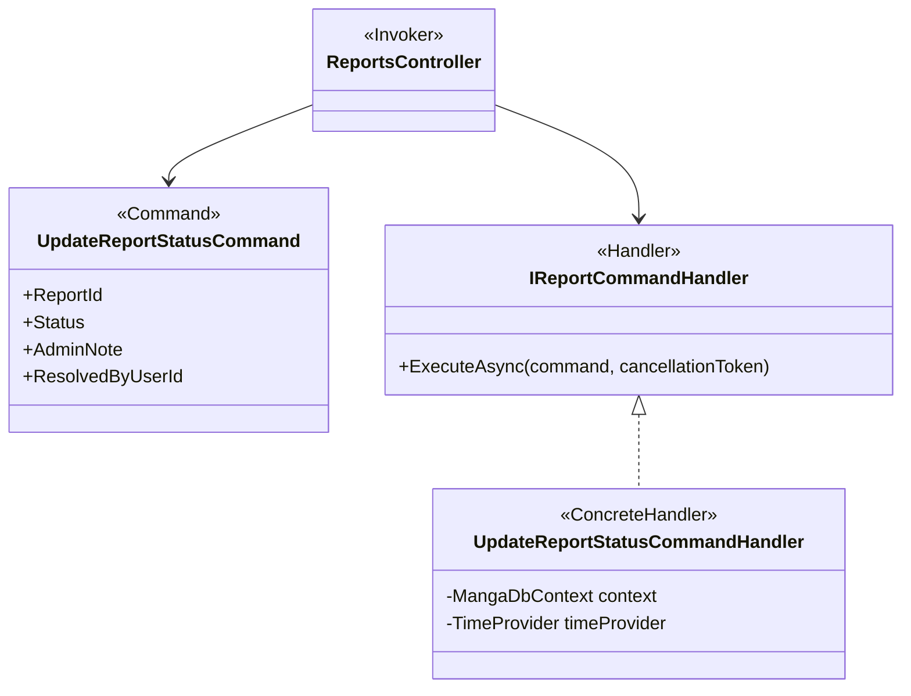

# Thiết kế bổ sung bốn GoF Patterns cho WebDocTruyen

## 1. Mục tiêu

Bổ sung bốn mẫu thuộc đúng danh sách 20 mẫu đã khảo sát để dự án đạt tổng cộng 10/20:

1. Decorator.
2. Proxy.
3. Factory Method.
4. Command.

Việc tái cấu trúc phải giữ nguyên hành vi đang hoạt động:

- Không đổi URL hoặc HTTP method.
- Không đổi request DTO hoặc JSON response.
- Không đổi giao diện hay JavaScript.
- Không thêm migration hoặc thay đổi schema database.
- Không thay đổi quy tắc tạo truyện, duyệt bản nháp, import MangaDex hoặc xử lý báo cáo.
- Không thực hiện request MangaDex thật trong automated tests.

## 2. Trạng thái sau khi hoàn thành

| Nhóm | Mẫu |
|---|---|
| Creational | Singleton, Builder, Factory Method |
| Structural | Adapter, Facade, Decorator, Proxy |
| Behavioral | Strategy, Chain of Responsibility, Command |

Tổng cộng: 10/20.

## 3. Nguyên tắc triển khai

### 3.1. Tái cấu trúc theo hành vi hiện tại

Mỗi thay đổi phải đi theo thứ tự:

1. Viết characterization test ghi lại hành vi hiện tại.
2. Chạy test và xác nhận test đạt trên code cũ.
3. Thực hiện refactor nhỏ nhất.
4. Chạy targeted tests.
5. Chạy toàn bộ test suite trước khi chuyển sang pattern kế tiếp.

### 3.2. Không tạo pattern chỉ để trình diễn

- Mọi concrete class phải có điểm gọi thật trong production code.
- Không tạo implementation không được DI hoặc service sử dụng.
- Không thêm tính năng mới chỉ để chứng minh pattern.
- Không đổi quy trình người dùng.

### 3.3. Giữ ranh giới trách nhiệm

- Factory Method chỉ tạo `Manga`; transaction và quan hệ vẫn thuộc application service.
- Decorator chỉ thêm cache cho page URL.
- Proxy chỉ kiểm soát/log lời gọi metadata MangaDex.
- Command handler chỉ chứa nghiệp vụ cập nhật trạng thái report.

## 4. Decorator Pattern

### 4.1. Vấn đề hiện tại

`MangaDexService.GetChapterPageUrlsAsync()` vừa:

- Gọi MangaDex At-Home API.
- Parse dữ liệu.
- Xây page URL.
- Đọc và ghi `IMemoryCache`.

Caching là cross-cutting concern và đang trộn với concrete component.

### 4.2. Cấu trúc



### 4.3. Interface

```csharp
public interface IMangaDexChapterPageService
{
    Task<List<string>> GetChapterPageUrlsAsync(
        string chapterExternalId,
        bool dataSaver = false,
        CancellationToken cancellationToken = default);
}
```

Giữ nguyên tên, tham số và kiểu trả về của method hiện tại để client chỉ cần đổi constructor dependency.

### 4.4. Concrete component

`MangaDexService` implement `IMangaDexChapterPageService`. Method giữ nguyên phần gọi API và parse URL, nhưng bỏ `IMemoryCache`.

### 4.5. Decorator

```csharp
public sealed class CachedMangaDexChapterPageService(
    IMangaDexChapterPageService inner,
    IMemoryCache cache) : IMangaDexChapterPageService
{
    private static readonly TimeSpan CacheDuration = TimeSpan.FromMinutes(5);
    private readonly IMangaDexChapterPageService _inner = inner;
    private readonly IMemoryCache _cache = cache;

    public async Task<List<string>> GetChapterPageUrlsAsync(
        string chapterExternalId,
        bool dataSaver = false,
        CancellationToken cancellationToken = default)
    {
        var cacheKey = $"mangadex-at-home:{chapterExternalId}:{dataSaver}";
        if (_cache.TryGetValue(cacheKey, out List<string>? cached)
            && cached is not null)
        {
            return cached;
        }

        var urls = await _inner.GetChapterPageUrlsAsync(
            chapterExternalId,
            dataSaver,
            cancellationToken);

        _cache.Set(cacheKey, urls, CacheDuration);
        return urls;
    }
}
```

### 4.6. Client và DI

`ChapterController` và `ChapterViewController` đổi dependency từ `MangaDexService` sang `IMangaDexChapterPageService`. Route và action không đổi.

```csharp
builder.Services.AddHttpClient<MangaDexService>();
builder.Services.AddScoped<IMangaDexChapterPageService>(provider =>
    new CachedMangaDexChapterPageService(
        provider.GetRequiredService<MangaDexService>(),
        provider.GetRequiredService<IMemoryCache>()));
```

### 4.7. Test bắt buộc

- Cache miss gọi inner đúng một lần và trả kết quả.
- Cache hit không gọi inner lần hai.
- `dataSaver=false` và `dataSaver=true` dùng hai cache key khác nhau.
- Exception và cancellation từ inner được truyền nguyên vẹn.
- Hai controller phụ thuộc interface mới.

## 5. Proxy Pattern

### 5.1. Mục tiêu

Tạo một subject interface cho metadata MangaDex và một proxy kiểm soát lời gọi trước khi đến real subject. Proxy chỉ ghi log an toàn; không thay đổi input, output, exception hoặc retry behavior.

### 5.2. Cấu trúc



### 5.3. Subject interface

```csharp
public interface IMangaDexService
{
    Task<MangaDexPreviewDto> GetMangaPreviewAsync(
        string input,
        CancellationToken cancellationToken = default);

    Task<List<MangaDexChapterDto>> GetVietnameseChaptersAsync(
        string mangaId,
        CancellationToken cancellationToken = default);
}
```

### 5.4. Real subject

`MangaDexService` implement đồng thời:

```csharp
public class MangaDexService :
    IMangaDexService,
    IMangaDexChapterPageService
```

`MangaDexService` không còn phụ thuộc `IMemoryCache`. Nó chỉ phụ thuộc typed `HttpClient`.

### 5.5. Proxy

Proxy không log URL/input thô. Nó chỉ log tên operation, kết quả và mã MangaDex đã được parser xác nhận khi có thể xác nhận mà không làm thay đổi luồng. Để bảo đảm tuyệt đối không thay đổi exception timing, bản đầu chỉ log tên operation và số lượng kết quả.

```csharp
public sealed class LoggingMangaDexProxy(
    IMangaDexService inner,
    ILogger<LoggingMangaDexProxy> logger) : IMangaDexService
{
    private readonly IMangaDexService _inner = inner;
    private readonly ILogger<LoggingMangaDexProxy> _logger = logger;

    public async Task<MangaDexPreviewDto> GetMangaPreviewAsync(
        string input,
        CancellationToken cancellationToken = default)
    {
        _logger.LogInformation("Calling MangaDex preview API.");
        try
        {
            var result = await _inner.GetMangaPreviewAsync(
                input,
                cancellationToken);
            _logger.LogInformation("MangaDex preview API succeeded.");
            return result;
        }
        catch (Exception exception)
            when (exception is not OperationCanceledException)
        {
            _logger.LogError(
                exception,
                "MangaDex preview API failed.");
            throw;
        }
    }

    public async Task<List<MangaDexChapterDto>> GetVietnameseChaptersAsync(
        string mangaId,
        CancellationToken cancellationToken = default)
    {
        _logger.LogInformation("Calling MangaDex chapter feed API.");
        try
        {
            var result = await _inner.GetVietnameseChaptersAsync(
                mangaId,
                cancellationToken);
            _logger.LogInformation(
                "MangaDex chapter feed returned {ChapterCount} chapters.",
                result.Count);
            return result;
        }
        catch (Exception exception)
            when (exception is not OperationCanceledException)
        {
            _logger.LogError(
                exception,
                "MangaDex chapter feed API failed.");
            throw;
        }
    }
}
```

`OperationCanceledException` không bị ghi thành lỗi và được truyền thẳng cho client. Các exception khác được log rồi rethrow bằng `throw;`, giữ nguyên loại lỗi và stack trace.

### 5.6. Client và DI

`MangaDexImportService` đổi dependency sang `IMangaDexService`.

```csharp
builder.Services.AddHttpClient<MangaDexService>();
builder.Services.AddScoped<IMangaDexService>(provider =>
    new LoggingMangaDexProxy(
        provider.GetRequiredService<MangaDexService>(),
        provider.GetRequiredService<ILogger<LoggingMangaDexProxy>>()));
```

### 5.7. Test bắt buộc

- Proxy chuyển tiếp đúng input và cancellation token.
- Proxy trả đúng object/list do real subject trả về.
- Proxy chỉ gọi real subject một lần.
- Proxy rethrow cùng exception.
- `MangaDexImportService` phụ thuộc `IMangaDexService`.
- DI resolve được `IMangaDexService` và `IMangaDexChapterPageService` mà không circular dependency.

## 6. Factory Method Pattern

### 6.1. Phạm vi thực tế

Codebase có bốn luồng tạo `Manga`:

1. `CatalogAdminService.CreateMangaAsync()` từ `CreateMangaDto`.
2. `TitleDraftAdminService.ApproveAsync()` từ `TitleDraft`.
3. `TitleSubmissionService.CreateMangaAsync()` từ `TitleSubmissionPayload`.
4. `MangaDexImportService.ImportAsync()` từ `MangaDexPreviewDto` khi manga chưa tồn tại.

Factory Method phải được sử dụng thật trong cả bốn luồng. Nếu tạo concrete creator nhưng không tích hợp vào production code thì không được tính.

### 6.2. Ranh giới

Creator chỉ chịu trách nhiệm:

- Tạo `Manga`.
- Gán các trường scalar theo đúng logic hiện tại.
- Chạy normalization chung an toàn.

Creator không:

- Truy cập database.
- Bắt đầu hoặc commit transaction.
- Tạo author/genre/theme relationship.
- Duyệt draft.
- Import chapter.

Nhờ đó transaction và thứ tự `SaveChangesAsync()` trong các application service được giữ nguyên.

### 6.3. Abstract creator

```csharp
public abstract class MangaCreator<TSource>
{
    public Manga Create(TSource source, DateTime now)
    {
        ArgumentNullException.ThrowIfNull(source);
        return CreateManga(source, now);
    }

    protected abstract Manga CreateManga(TSource source, DateTime now);
}
```

`Create()` là operation của creator; `CreateManga()` là factory method được concrete creator override. Không đặt normalization dùng chung trong base class vì bốn luồng hiện tại không trim và gán mặc định hoàn toàn giống nhau. Mỗi concrete creator phải giữ đúng mapping của luồng tương ứng.

### 6.4. Concrete creators

```csharp
public sealed class CatalogMangaCreator
    : MangaCreator<CreateMangaDto>
{
    protected override Manga CreateManga(
        CreateMangaDto dto,
        DateTime now) => new()
    {
        Title = dto.Title,
        AlternativeTitle = dto.AlternativeTitle,
        Description = dto.Description,
        CoverUrl = dto.CoverUrl,
        Type = dto.Type,
        Status = dto.Status,
        Demographic = dto.Demographic,
        Format = dto.Format,
        ContentWarnings = string.Join(
            ',',
            MangaContentWarning.Normalize(dto.ContentWarnings)),
        ReleaseYear = dto.ReleaseYear,
        Source = "Local",
        ExternalId = string.Empty,
        CreatedAt = now
    };
}
```

Ba concrete creator còn lại:

- `TitleDraftMangaCreator : MangaCreator<TitleDraft>`
- `TitleSubmissionMangaCreator : MangaCreator<TitleSubmissionPayload>`
- `MangaDexMangaCreator : MangaCreator<MangaDexPreviewDto>`

Mỗi class phải sao chép chính xác mapping hiện tại, bao gồm:

- `AlternativeTitle`.
- `ContentWarnings`.
- `Format` fallback của Webtoon draft.
- `Source`.
- `ExternalId`.
- `CreatedAt`.
- `SyncedAt`.

### 6.5. DI

```csharp
builder.Services.AddScoped<CatalogMangaCreator>();
builder.Services.AddScoped<TitleDraftMangaCreator>();
builder.Services.AddScoped<TitleSubmissionMangaCreator>();
builder.Services.AddScoped<MangaDexMangaCreator>();
```

Các creator stateless, nhưng dùng `Scoped` để thống nhất với application services và tránh thay đổi vòng đời không cần thiết.

### 6.6. Tích hợp

Mỗi service inject creator tương ứng và thay duy nhất biểu thức `new Manga { ... }`:

```csharp
var manga = creator.Create(dto, DateTime.UtcNow);
```

Phần sau không thay đổi:

```csharp
_context.Mangas.Add(manga);
await _context.SaveChangesAsync(cancellationToken);
// Add/attach relations...
await transaction.CommitAsync(cancellationToken);
```

Đối với `MangaDexImportService`, creator chỉ chạy khi `manga == null`. Luồng cập nhật manga đã tồn tại tiếp tục dùng mapping hiện tại trong giai đoạn đầu để tránh thay đổi behavior.

### 6.7. Test bắt buộc

Mỗi concrete creator có characterization test so sánh toàn bộ scalar properties với kết quả mapping cũ.

Ngoài ra:

- Creator trim title đúng như code cũ.
- `CatalogMangaCreator` giữ `Source = "Local"`.
- `TitleDraftMangaCreator` giữ Webtoon format fallback.
- `TitleSubmissionMangaCreator` giữ cách ghép alternative titles.
- `MangaDexMangaCreator` giữ `Source`, `ExternalId` và `SyncedAt`.
- Reflection/architecture test chứng minh cả bốn production service phụ thuộc creator phù hợp.
- Service tests chứng minh transaction và quan hệ vẫn được tạo như trước.

## 7. Command Pattern

### 7.1. Vấn đề hiện tại

`ReportsController.UpdateStatus()` vừa:

- Parse status.
- Kiểm tra `Pending`.
- Tìm report.
- Gán trạng thái.
- Gán thời gian/người xử lý.
- Chuẩn hóa admin note.
- Lưu database.
- Chuyển kết quả thành HTTP response.

Nghiệp vụ xử lý report được chuyển thành command + handler, còn controller chỉ tạo command và map kết quả.

### 7.2. Cấu trúc



### 7.3. Command và result

```csharp
public sealed record UpdateReportStatusCommand(
    int ReportId,
    string? Status,
    string? AdminNote,
    int? ResolvedByUserId);

public enum ReportCommandStatus
{
    Success,
    NotFound,
    BadRequest
}

public sealed record ReportCommandResult(
    ReportCommandStatus Status,
    string Message = "",
    int? ReportId = null,
    ReportStatus? ReportStatus = null);
```

### 7.4. Handler contract

```csharp
public interface IReportCommandHandler
{
    Task<ReportCommandResult> ExecuteAsync(
        UpdateReportStatusCommand command,
        CancellationToken cancellationToken = default);
}
```

### 7.5. Concrete handler

Handler sao chép chính xác logic hiện tại:

```csharp
public sealed class UpdateReportStatusCommandHandler(
    MangaDbContext context,
    TimeProvider timeProvider) : IReportCommandHandler
{
    public async Task<ReportCommandResult> ExecuteAsync(
        UpdateReportStatusCommand command,
        CancellationToken cancellationToken = default)
    {
        if (!Enum.TryParse<ReportStatus>(
                command.Status,
                true,
                out var status)
            || status == ReportStatus.Pending)
        {
            return new(
                ReportCommandStatus.BadRequest,
                "Trạng thái xử lý không hợp lệ.");
        }

        var report = await context.Reports.FindAsync(
            [command.ReportId],
            cancellationToken);

        if (report is null)
        {
            return new(
                ReportCommandStatus.NotFound,
                "Không tìm thấy báo cáo.");
        }

        report.Status = status;
        report.ResolvedAt = timeProvider.GetUtcNow().UtcDateTime;
        report.ResolvedByUserId = command.ResolvedByUserId;
        report.AdminNote = string.IsNullOrWhiteSpace(command.AdminNote)
            ? null
            : command.AdminNote.Trim();

        await context.SaveChangesAsync(cancellationToken);

        return new(
            ReportCommandStatus.Success,
            ReportId: report.Id,
            ReportStatus: report.Status);
    }
}
```

### 7.6. Controller sau refactor

Route, DTO và response giữ nguyên:

```csharp
[HttpPatch("{id:int}")]
[RequireAdmin]
public async Task<IActionResult> UpdateStatus(
    int id,
    [FromBody] UpdateReportDto dto)
{
    var command = new UpdateReportStatusCommand(
        id,
        dto.Status,
        dto.AdminNote,
        HttpContext.Session.GetInt32("UserId"));

    var result = await _reportCommandHandler.ExecuteAsync(
        command,
        HttpContext.RequestAborted);

    return result.Status switch
    {
        ReportCommandStatus.BadRequest =>
            BadRequest(new { message = result.Message }),
        ReportCommandStatus.NotFound =>
            NotFound(new { message = result.Message }),
        _ => Ok(new
        {
            id = result.ReportId,
            status = result.ReportStatus!.Value.ToString()
        })
    };
}
```

### 7.7. Test bắt buộc

- Status không hợp lệ trả BadRequest với đúng thông báo.
- `Pending` bị từ chối.
- Report không tồn tại trả NotFound.
- `Resolved` và `Dismissed` được lưu đúng.
- `ResolvedAt` lấy từ fake `TimeProvider`.
- `ResolvedByUserId` giữ nguyên user từ session.
- Admin note rỗng thành `null`; note có nội dung được trim.
- Controller trả JSON có cùng `id` và chuỗi `status` như trước.
- Endpoint vẫn là `PATCH /api/reports/{id}` và vẫn có `[RequireAdmin]`.

## 8. Thứ tự triển khai an toàn

1. Chụp baseline test.
2. Decorator cho page cache.
3. Proxy cho metadata API.
4. Factory Method cho từng creator, tích hợp từng service một.
5. Command cho report moderation.
6. Cập nhật tài liệu design patterns.
7. Chạy verification đầy đủ.

Factory Method được làm sau MangaDex interfaces để tránh sửa cùng constructor nhiều lần.

## 9. Kế hoạch rollback

Mỗi pattern nằm trong một commit độc lập:

1. `refactor: decorate MangaDex chapter page caching`
2. `refactor: proxy MangaDex metadata requests`
3. `refactor: centralize manga creation with factory methods`
4. `refactor: handle report moderation as commands`
5. `docs: document ten design patterns`

Nếu một pattern gây regression, có thể revert đúng commit đó mà không ảnh hưởng ba pattern còn lại.

Không thay đổi migration nên rollback không cần chỉnh database.

## 10. Verification cuối

### Automated

```powershell
dotnet test backend.Tests\MangaNPK.Tests.csproj `
  --configuration Release `
  --no-restore `
  --filter "FullyQualifiedName!~SourceEncodingTests"

node --test backend.Tests\js

dotnet build backend\MangaNPK.csproj `
  --configuration Release `
  --no-restore

git diff --check
```

`SourceEncodingTests` được loại riêng vì hiện nó đi vào thư mục ngoài phạm vi `appthoitrang_ascii` và gặp lỗi quyền truy cập; đây không phải lỗi của thay đổi design patterns.

### Contract checks

- Tất cả route trước và sau giống nhau.
- Tất cả request/response DTO giống nhau.
- Không có migration mới.
- Không có thay đổi trong `Views/` hoặc `wwwroot/`.
- DI container resolve được toàn bộ service mới.
- Không có request mạng thật trong test.

### Manual smoke test

1. Mở trang chủ và chi tiết truyện.
2. Đọc chapter MangaDex hai lần để kiểm tra page cache.
3. Preview/import một truyện MangaDex.
4. Tạo truyện local.
5. Duyệt một title draft.
6. Gửi report và admin chuyển sang Resolved/Dismissed.
7. Kiểm tra trang “Báo cáo của tôi” hiển thị trạng thái mới.

## 11. Tiêu chí hoàn thành

- Bốn mẫu mới có cấu trúc GoF rõ ràng và được production code sử dụng.
- Tổng tài liệu ghi đúng 10/20 mẫu.
- Không có code minh họa chết.
- Không đổi hành vi API hoặc UI.
- Targeted tests và toàn bộ regression suite đạt.
- Build Release không có error.
- Mỗi pattern có thể revert độc lập.
